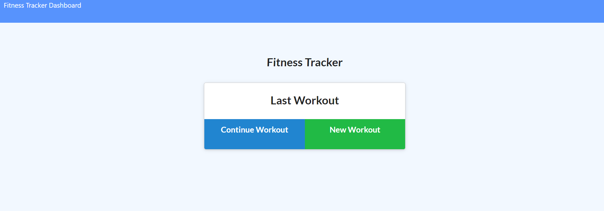

# Fitness Tracker

## Description 

This is a fitness tracker that let's the user keep track of their exercise's and activities then display's workout in graphs.

## User Story

As a user, I want to be able to view create and track daily workouts. I want to be able to log multiple exercises in a workout on a given day. I should also be able to track the name, type, weight, sets, reps, and duration of exercise. If the exercise is a cardio exercise, I should be able to track my distance traveled.

### App screenshot

   

## Table of contents

- [Description](#Description)
- [Usage](#Usage)
- [Technologies](#Technologies)
- [Licence](#Licence)
- [Repository Link](#Repository)
- [GitHub Info](#GitHub) 

## Usage

Go to [Fitness Tracker](https://fitnesst.herokuapp.com/) 

## Technologies
* MongoDB
* Mongoose
* Node.js
* Express

## Licence

## Repository

- [Project Repo](https://github.com/morrow7564/fitness-tracker)

## GitHub

- Christopher Morrow
- [GitHub Profile](https://github.com/morrow7564)

